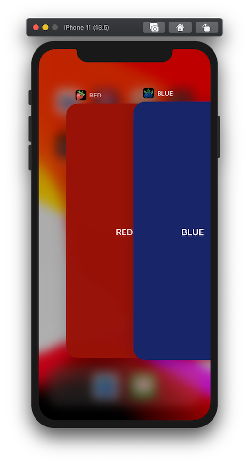

# RED vs BLUE

_React Native white label by config_

## Context

This demo React Native application showcases a simple white label implementation by environment configuration. This means:

- One codebase.
- Centralised config for Android, iOS and JS variables.
- No flavors, no extra schemes, no extra targets.
- No hassle. Just run:

``` shell
yarn ios:red
yarn ios:blue
```

To get:



## Approach

The demo setup was achieved using the folling steps.

1. React native init.
2. Add and configure [react-native-ultimate-config](https://github.com/maxkomarychev/react-native-ultimate-config). (Their comprehensive documentation is amazing 🤩)
3. Set up `.env` files for each white label. I chose RED (`.env.red`) and BLUE (`.env.blue`).*
4. Set the environment variables for the app name, unique identifier and icon names (you can check the commits to see the exact approach).
5. (optional) Add yarn scripts to switch env file and run the correct build.

\* I chose to keep a default config (`.env`) as a fallback but on hindsight that wasn't necessary.

## When to choose this approach

- When you need to run out a few white label versions of your RN app.
- When you want to keep the codebase as consistent as possible between those white label versions.

## When NOT to choose this approach

- When you have to run a LOT of white label versions, you may want a setup that has a stricter separation between assets.
- When you want the white label versions to have differences beyond theme variables and feature flags. For example when different white labels will have different dependencies, you may be better off splitting into XCode targets/schemes and Android flavors. There is [experimental support](https://github.com/maxkomarychev/react-native-ultimate-config/blob/master/docs/cookbook.md) for this in react-native-ultimate-config if you still want to try to use it.

## Gotcha's

- When setting a dynamic android `applicationId` you must supply it to `react-native run-android` or it can not auto-launch the app after building. I chose to add this into the yarn scripts for convenience.
