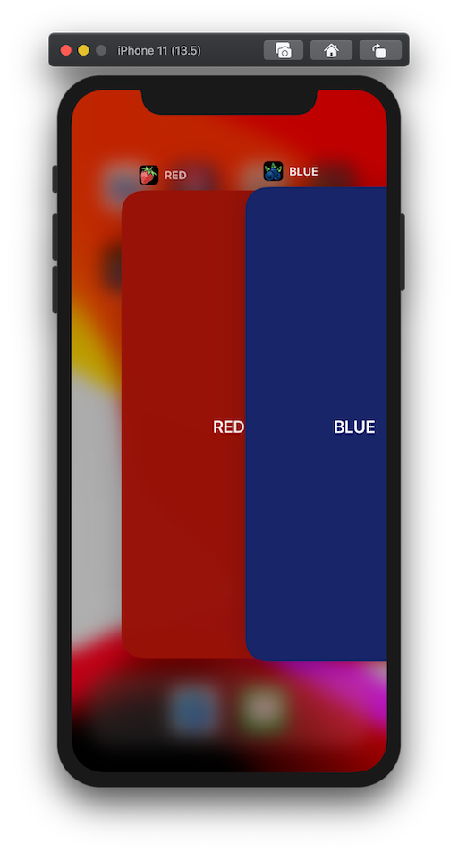
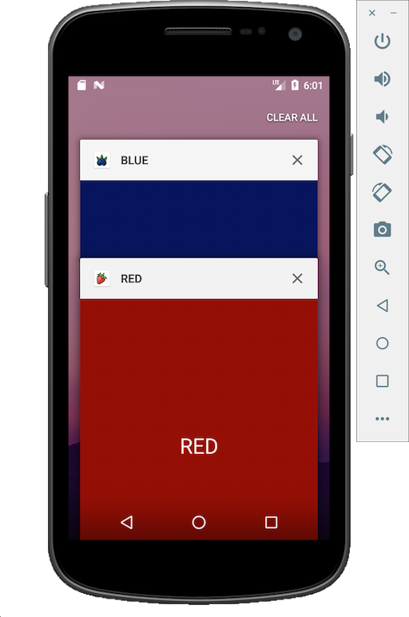

# RED vs BLUE

_React Native white label by config_

## Context

This demo React Native application showcases a simple white label implementation by environment configuration. This means:

- One codebase.
- Centralised config for Android, iOS and JS variables.
- No flavors, no extra schemes, no extra targets.
- No hassle. Just run:

``` shell
yarn ios:red
yarn ios:blue
```

To get:



``` shell
yarn android:red
yarn android:blue
```

To get:



## Approach

The demo setup was achieved using the following steps.

1. React native init.
1. Add and configure [react-native-ultimate-config](https://github.com/maxkomarychev/react-native-ultimate-config). (Their comprehensive documentation is amazing 🤩)
1. Set up `.env` files for each white label. I chose RED (`.env.red`) and BLUE (`.env.blue`).
1. Set the environment variables for the app name and unique identifier and icon names.
1. (optional) Set up asset folders for each white label and add [a hook script](.rnucrc.js) to copy the content into the `res` and `xcimages` folders when switching env files.
1. (optional) Add yarn scripts to switch env file and run the correct build.

For a more detailed explanation you can check the commits of this project. They follow the above steps, starting with a common asset pool and then extracting them into separate folders as suggested in step 5.

## When to choose this approach

- When you need to run out a few white label versions of your RN app.
- When you want to keep the codebase as consistent as possible between those white label versions.

## When NOT to choose this approach

When you want the white label versions to have differences beyond theme variables and feature flags. For example when different white labels will have different dependencies, you may be better off splitting into XCode targets/schemes and Android flavors. This is outside the scope of my research. There is [experimental support](https://github.com/maxkomarychev/react-native-ultimate-config/blob/master/docs/cookbook.md) for flavors and schemes in react-native-ultimate-config, but since these functionalities are intertwined within the build process it will probably never be completely supported.

In my personal opinion you would probably be better off splitting your project into separate apps that use common functionality through shared libraries in those cases.

## Gotcha's

- When setting a dynamic android `applicationId` you must supply it to `react-native run-android` or it can not auto-launch the app after building. I chose to add this into the yarn scripts for convenience.
